# SDIF iOS

Native iOS app for the Swiss Drug Interaction Finder (SDIF). Ported from the [Rust web application](https://github.com/zdavatz/sdif).

## Screenshots

### iPhone

| Medikamentensuche | Interaktionen | Klinische Vorschläge |
|---|---|---|
| 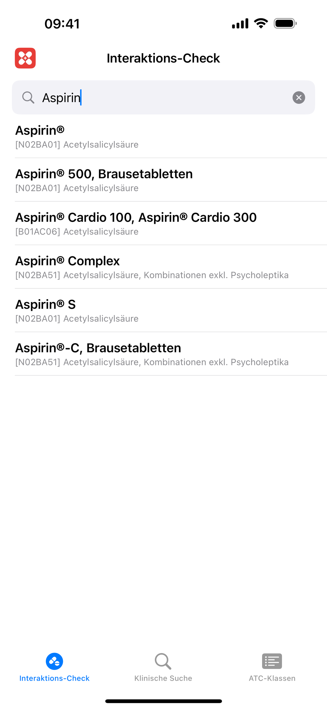 | 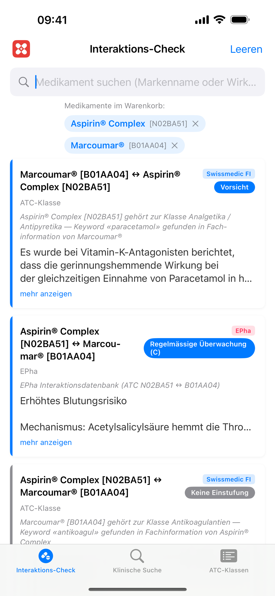 | 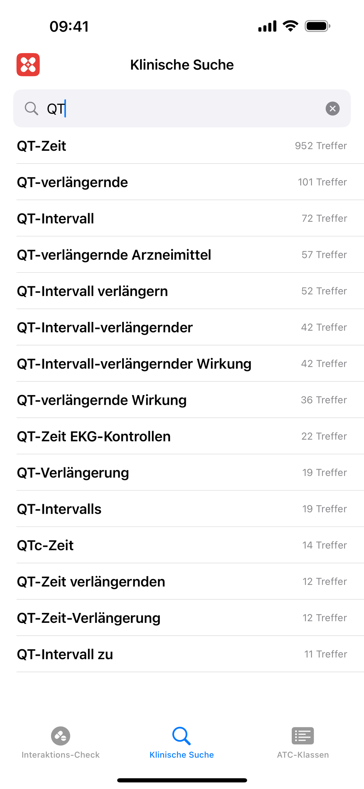 |

| Klinische Resultate | ATC-Klassen | Einstellungen |
|---|---|---|
| 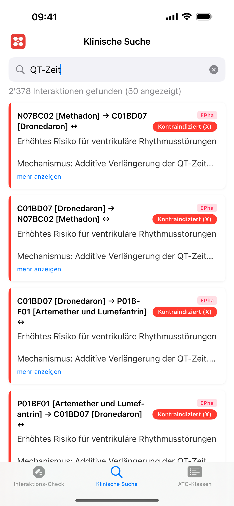 | 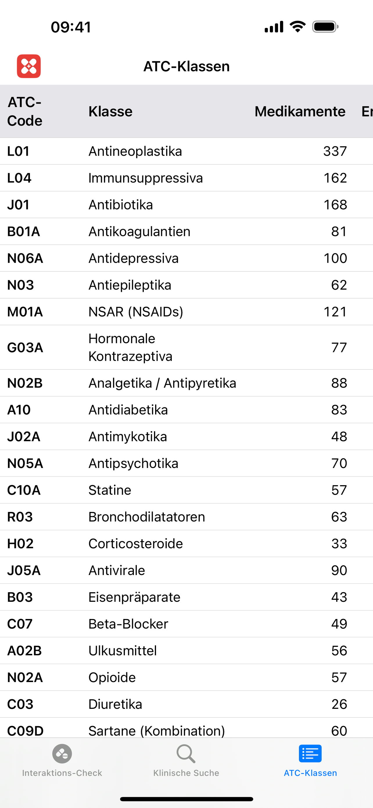 | 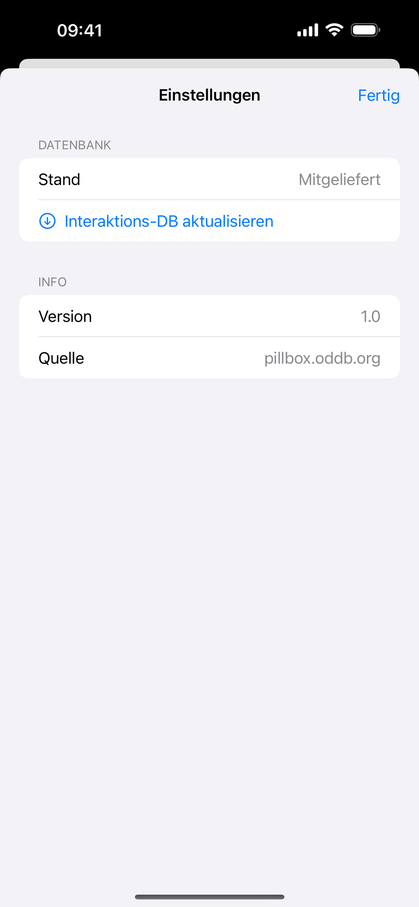 |

### iPad

| Medikamentensuche | Interaktionen | Klinische Vorschläge |
|---|---|---|
| 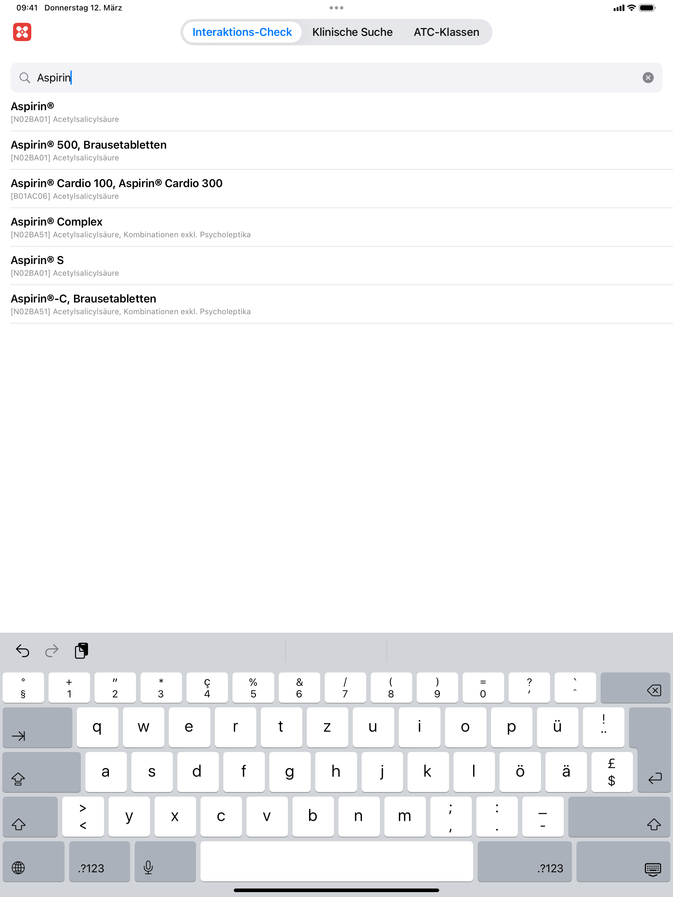 | 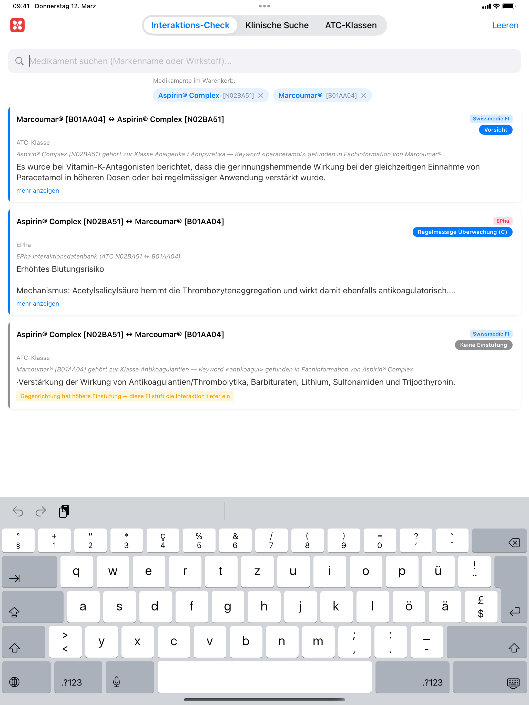 | 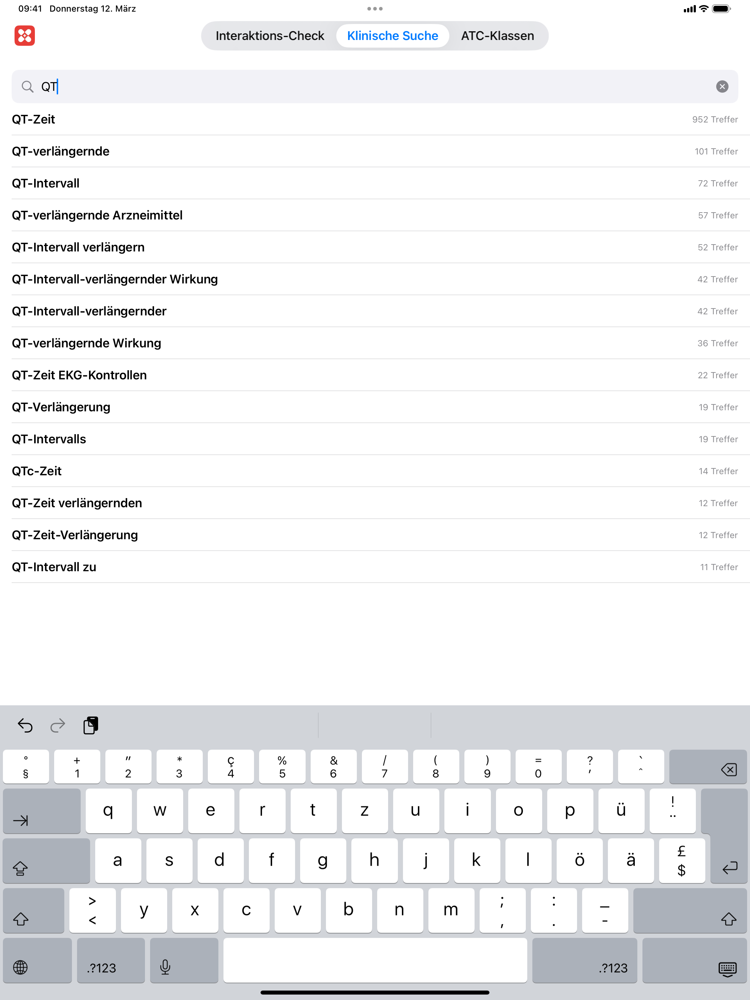 |

| Klinische Resultate | ATC-Klassen | Einstellungen |
|---|---|---|
| 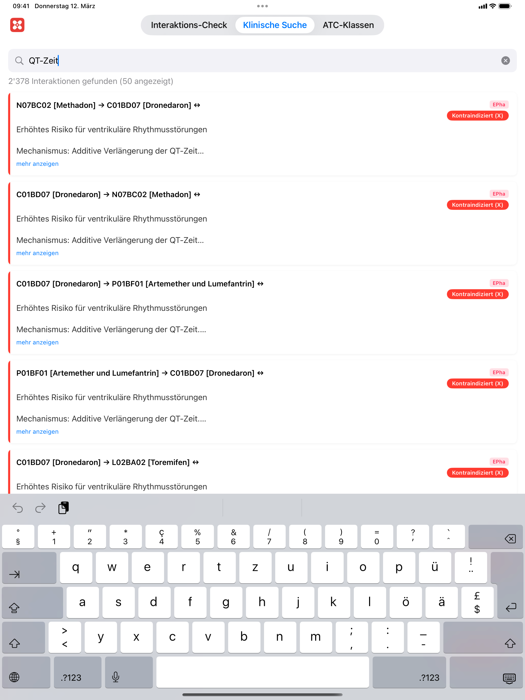 | 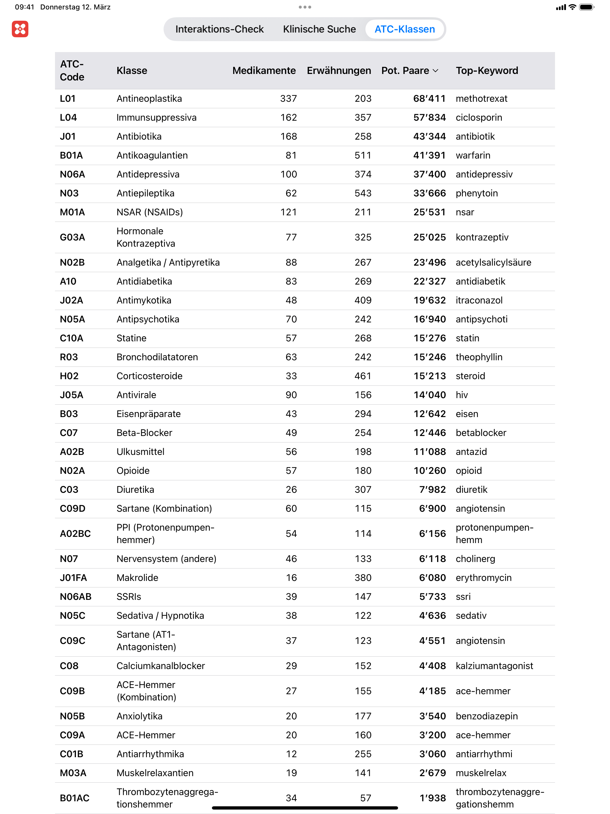 | 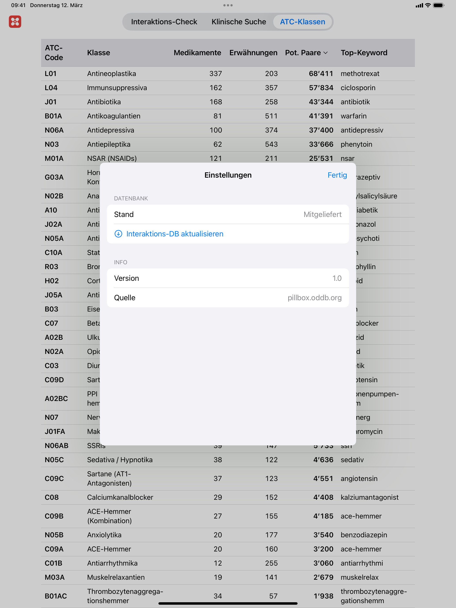 |

## Features

- **Interaktions-Check**: Search drugs by brand name or substance, add to basket, check all pairwise interactions
- **Klinische Suche**: Full-text clinical search across interaction descriptions with type-ahead suggestions and pagination
- **ATC-Klassen**: Sortable overview table of ATC drug class interactions
- **Settings**: Tap the app icon (top-left) to open settings and download the latest interaction database from pillbox.oddb.org
- **Copy support**: Long-press interaction cards to select text or copy all card content (title, source, severity, description)

### Interaction Detection

Four strategies ported from the Rust backend:
1. **Substance match** — direct substance-to-substance interactions from Swissmedic FI texts
2. **ATC class-level** — keyword-based class interactions (e.g., all NSAIDs with anticoagulants)
3. **CYP enzyme** — cytochrome P450 inhibitor/inducer/substrate interactions
4. **EPha curated** — Swiss EPha pharmacovigilance database

### Severity Scoring

Color-coded severity (0–3) with German keyword matching: kontraindiziert, schwerwiegend, Vorsicht.

## Requirements

- iOS 17.0+
- Xcode 16+
- [xcodegen](https://github.com/yonaskolb/XcodeGen)

## Build

```bash
# Generate Xcode project
xcodegen generate

# Build for simulator
xcodebuild -project SDIF.xcodeproj -scheme SDIF \
  -destination 'platform=iOS Simulator,name=iPhone 17' build

# For physical device: open SDIF.xcodeproj in Xcode,
# set your development team under Signing & Capabilities, then build.
```

## Screenshots Generation

Screenshots are generated automatically via UI tests:

```bash
# iPhone (1284x2778 for App Store 6.5")
xcodebuild test -project SDIF.xcodeproj -scheme SDIFUITests \
  -destination 'platform=iOS Simulator,name=iPhone 15 Plus'

# iPad (2064x2752 for App Store 13")
xcodebuild test -project SDIF.xcodeproj -scheme SDIFUITests \
  -destination 'platform=iOS Simulator,name=iPad Pro 13-inch (M4)'
```

Output is saved to `screenshots/` (iPhone) and `screenshots/ipad/` (iPad). Includes `app_preview.mp4` video.

## Database

The app downloads `interactions.db` from `http://pillbox.oddb.org/interactions.db` via Settings. A bundled copy in `SDIF/Resources/` is used as fallback. The database is not tracked in git.

## License

GPLv3
